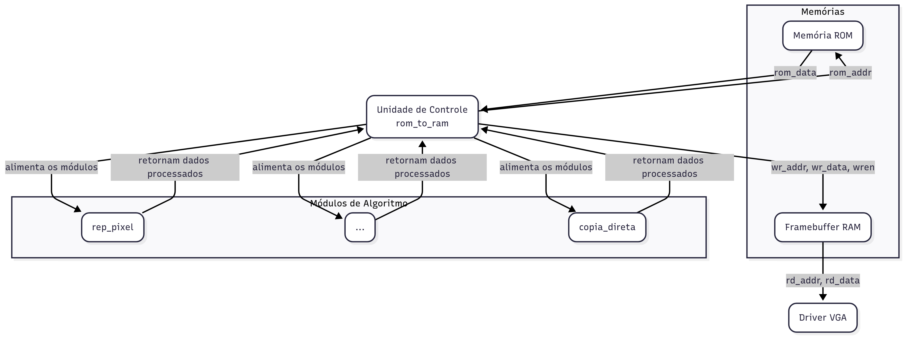

# Problema 1 – Zoom Digital: Redimensionamento de Imagens com FPGA em Verilog

<h2>Descrição do Projeto</h2>

Esse projeto tem o objetivo de implementar um coprocessador gráfico para realizar, em tempo real, redimensionamento de imagens gerando sobre elas efeitos de Zoom-In e Zoom-Out. Esse processo foi feito utilizando o kit de desenvolvimento DE1-SoC, que contém um coprocessador Cyclone V. O sistema aplica técnicas que buscam variar o dimensionamento de imagens em escala de cinza, com representação de pixels em 8 bits, e exibe o resultado via saída VGA. O ambiente de desenvolvimento utilizado foi o Intel Quartus Prime Lite 23.1, e a linguagem de descrição de hardware usada foi o Verilog.

O coprocessador gráfico conseguiu fazer o redimensionamento de imagens a partir dos seguintes algoritmos:
a) Replicação de pixel(Zoom-In)
b) Vizinho mais próximo(Zoom-In)
c) Decimação(Zoom-Out)
d) Média de blocos(Zoom-Out)
Vale lembrar que esses algoritmos devem garantir que o redimensionamento da imagem possa ocorrer em 2x.

<h2 id="arquitetura">Arquitetura e Caminho de Dados</h2>

  <h2 id="ula">Unidade Lógica e Aritmética (ULA)</h2>
  

    A ULA do coprocessador é a responsável por aplicar os algoritmos sobre a imagem, a partir da escolha feita no OpCode. Nesse tópico ocorrerá um aprofundamento acerca dos algoritmos os quais foram utilizados para resolução do projeto. 
  

