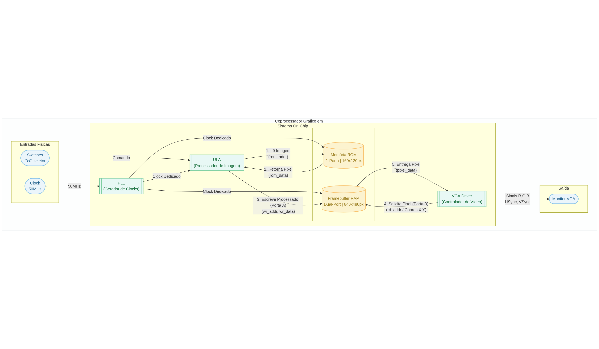
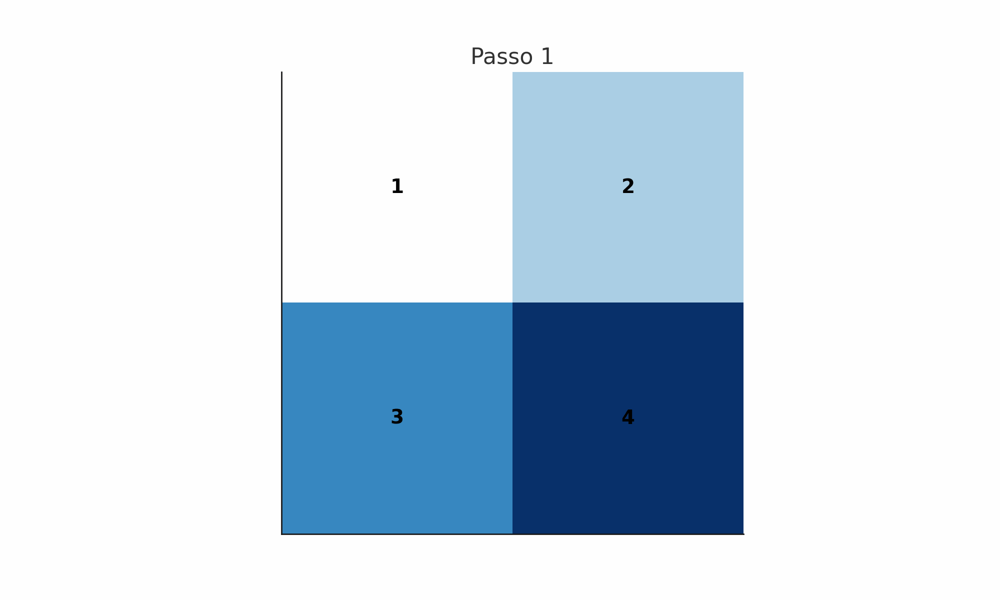
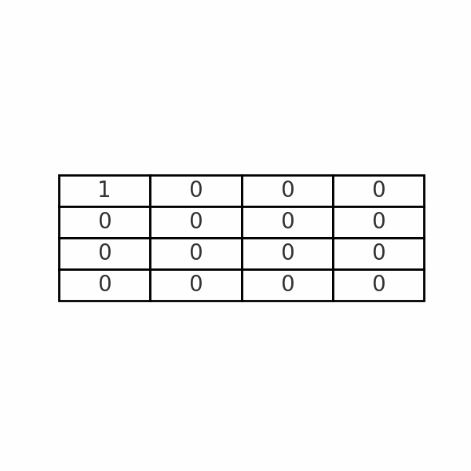
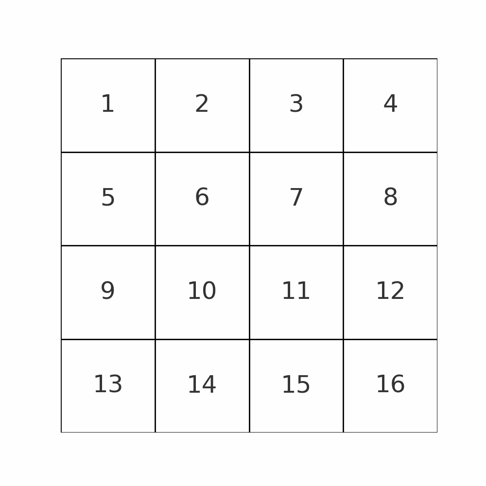
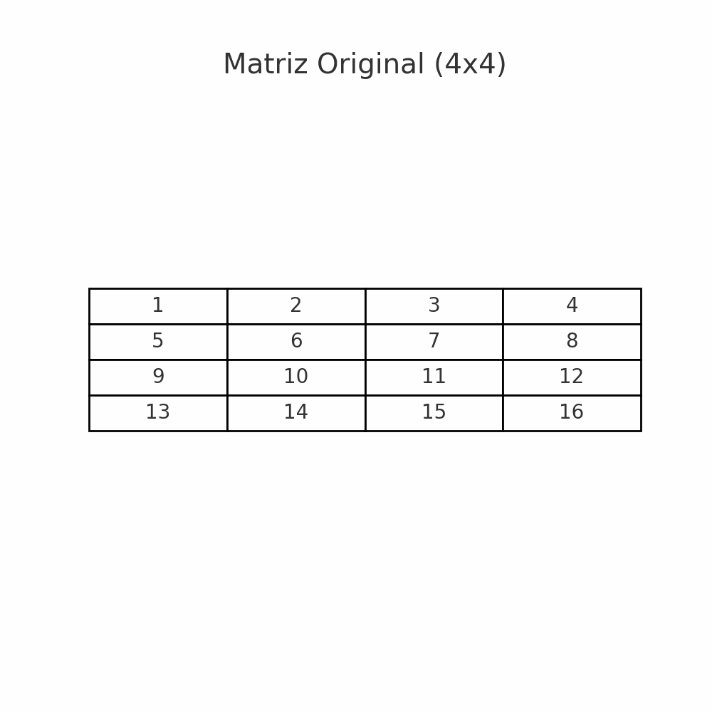

# Problema 1 – Zoom Digital: Redimensionamento de Imagens com FPGA em Verilog

<h2>Descrição do Projeto</h2>

Esse projeto tem o objetivo de implementar um coprocessador gráfico para realizar, em tempo real, redimensionamento de imagens gerando sobre elas efeitos de Zoom-In e Zoom-Out. Esse processo foi feito utilizando o kit de desenvolvimento DE1-SoC, que contém um coprocessador Cyclone V. O sistema aplica técnicas que buscam variar o dimensionamento de imagens em escala de cinza, com representação de pixels em 8 bits, e exibe o resultado via saída VGA. O ambiente de desenvolvimento utilizado foi o Intel Quartus Prime Lite 23.1, e a linguagem de descrição de hardware usada foi o Verilog.

     
    <strong>Imagem do Site da Altera</strong>  
  

    

O coprocessador gráfico consegue fazer o redimensionamento de imagens a partir dos seguintes algoritmos:

    a) Replicação de pixel(Zoom-In)

b) Vizinho mais próximo(Zoom-In)

c) Decimação(Zoom-Out)

d) Média de blocos(Zoom-Out)

Vale lembrar que esses algoritmos devem garantir que o redimensionamento da imagem possa ocorrer em 2x.

# Sumário
- [Descrição do Projeto](#descrição-do-projeto)  
- [Arquitetura e Caminho de Dados](#arquitetura-e-caminho-de-dados)  
  - [Componentes Principais](#componentes-principais)  
- [DataPath e Fluxo de Execução](#datapath-e-fluxo-de-execução)  
  - [Visão Geral do Fluxo](#visão-geral-do-fluxo)  
- [Unidade de Controle](#unidade-de-controle)  
  - [Funções Principais](#funções-principais)  
  - [Fluxo Operacional](#fluxo-operacional)  
  - [Exemplo de Operação](#exemplo-de-operação)  
- [Unidade Lógica e Algorítmica (ULA)](#unidade-lógica-e-algorítmica-ula)  
  - [Integração com os Demais Blocos](#integração-com-os-demais-blocos)  
  - [Fluxo Operacional](#fluxo-operacional-1)  
  - [Exemplo de Operação](#exemplo-de-operação-1)
- [Memórias](#Memórias)
- [Algoritmos para Redimensionamento de Imagens](#algoritmos-para-redimensionamento-de-imagens)  
  - [Replicação de Pixel (Zoom-In)](#replicação-de-pixelzoom-in)
  - [Vizinho mais próximo (Zoom-In)](#vizinho-mais-próximozoom-in) 
  - [Decimação (Zoom-Out)](#decimaçãozoom-out)  
  - [Média de Blocos (Zoom-Out)](#média-de-blocoszoom-out)  
- [Módulo VGA](#módulo-vga)
  - [Temporização e Sincronismo](#temporização-e-sincronismo)  
  - [Escala, Centralização e Leitura do Framebuffer](#escala-centralização-e-leitura-do-framebuffer)
 
- [Resultados](#resultados)

## Arquitetura e Caminho de Dados

    O sistema segue o princípio de <strong>separação de funções</strong>, com uma hierarquia de controle clara e um <em>datapath</em> dedicado para as operações de imagem. O módulo de topo <code>control_unity</code> integra todos os componentes, enquanto a <code>ULA</code> atua como uma unidade de controle especializada, gerenciando o fluxo de dados entre as memórias e os aceleradores de hardware (módulos de algoritmo). Essa abordagem modular facilita a validação isolada de cada componente e permite que ferramentas de síntese otimizem cada parte de forma eficiente. Nesse tópico será abordada a arquitetura adotada no desenvolvimento do protótipo.

<h3>Componentes Principais</h3>
<ul>
    <li>
        <strong>ULA (<code>ULA</code>)</strong>:  
        FSM hierárquica que gerencia o fluxo do sistema. Com base nas entradas do usuário e nos sinais de status (<code>done</code>) dos submódulos, gera sinais de controle para ativar aceleradores de hardware, gerar endereços para a ROM e controlar escrita no Framebuffer.
    </li>
    <li>
        <strong>Framebuffer (RAM Dual-Port)</strong>:  
        Permite que processamento e exibição de vídeo ocorram de forma independente. Uma porta é usada para escrita pelo Datapath e outra para leitura pelo driver VGA, garantindo operação contínua a 25 MHz sem conflitos.
    </li>
    <li>
        <strong>Memória ROM</strong>:  
        Armazena a imagem original de 160x120 pixels em escala de cinza. A Unidade de Controle lê os pixels sequencialmente e fornece aos módulos de algoritmo para processamento.
    </li>
        <li>
        <strong>Memória RAM</strong>:
            Responsável por armazenar as imagens alteradas, sendo sempre sobreescrita de acordo com o algoritmo selecionado.
    </li>
    <li>
        <strong>Módulos dos Algoritmos</strong>:  
        Circuitos dedicados (<code>rep_pixel</code>, <code>copia_direta</code>, <code>zoom_nn</code>, <code>media_blocos</code>,
        <code>decimacao</code>) que processam pixels de forma paralela e otimizada. Alguns módulos operam em um ciclo, enquanto outros têm FSM interna para cálculos mais complexos, garantido mais eficiência na execução das operações.
    </li>
</ul>

## DataPath e fluxo de execução
<ol>
    <li>
        <strong>Sequência de Leitura, Processamento e Escrita</strong>
        <ul>
            <li>No estado <code>ST_RESET</code>, a Unidade de Controle lê a seleção do usuário e configura o Datapath.</li>
            <li>A FSM transita pelos estados operacionais, lendo pixels da ROM, enviando-os ao acelerador de hardware e escrevendo os resultados no Framebuffer.</li>
            <li>Cada módulo de algoritmo processa os dados com máxima eficiência, garantindo alta performance mesmo em operações complexas.</li>
        </ul>
    </li>
    <li>
        <strong>Exibição Paralela e Contínua</strong>
        <ul>
            <li>O driver VGA lê continuamente o Framebuffer pela porta de leitura, exibindo pixels a 25 MHz.</li>
            <li>O uso da RAM de porta dupla garante que o processamento de uma nova imagem ocorra em paralelo à exibição da imagem anterior, sem interrupções.</li>
        </ul>
    </li>
</ol>

<h3>Visão Geral do Fluxo</h3>

O diagrama abaixo ilustra a arquitetura completa do sistema, orquestrada pelo módulo de topo <code>control_unity</code>. Ele detalha a interação entre a Unidade Lógica e Aritmética (<code>ULA</code>), responsável pelo processamento da imagem, as memórias on-chip (<code>ROM</code> de origem e <code>Framebuffer RAM</code> dual-port) e o <code>VGA Driver</code>, que gera o sinal de vídeo final para o monitor.

  

## Unidade de Controle

Seguiremos agora, para uma explicação de cada um dos módulos do projeto, começando pela Unidade de Controle, que é implementada no módulo control_unity e funciona como o elemento principal do projeto. Ela é responsável por coordenar todo o fluxo do sistema, começando pela instanciação de todos os componentes principais, como as memórias ROM e RAM e a ALU, coordenação e geração do clock utilizado, sincronismo das chaves utilizadas, ativação dos algoritmos de redimensionamento e escrita ordenada no Framebuffer, com um resultado final exibido pelo driver VGA, a seguir, será explicado de forma detalhada e minunciosa o funcionamento de cada um dos componentes do módulo.

<h3>Funções Principais</h3>
<ul>
  <li><strong>Geração e Distribuição de Clocks:</strong>  
      Através da ferramente "IP catalog", disponível na IDE Quartus (utiliada para o desenvolvimento do projeto), foi criado um PLL para fornecer um clock estável aos blocos de memória, o que fornece uma valor preciso para os módulos principais.</li>
  <li><strong>Sincronização de Entradas:</strong>  
      As chaves sw são sincronizadas em registradores para evitar metastabilidade. Esses sinais determinam o modo de operação (replicação, decimação, zoom por vizinho mais próximo ou cópia direta).</li>
  <li><strong>Centralização e Endereçamento:</strong>  
      Calcula dinamicamente x_offset e y_offset, sinais do vga_driver, para centralizar a imagem na tela de 640×480, utilizada para desenvolvimento do projeto, esses sinais, geram o endereço do Framebuffer para cada pixel válido.</li>
  <li><strong>Controle da FSM:</strong>  
      A FSM do módulo de controle coordena a leitura de pixels da ROM, aciona o módulo de algoritmo selecionado e controla os sinais de escrita na RAM, permitindo com que o projeto funcione da melhor forma.</li>
</ul>

<h3>Fluxo Operacional</h3>

    Nessa seção, falaremos sobre toda a parte operacional do funcionamento da Unidade de Controle, que segue uma sequência bem definida de etapas. Inicialmente, assim que o sinal vga_reset é acionado, o sistema entra no estado de RESET. Nesse momento, são realizados os ajustes iniciais, incluindo a configuração dos fatores de escala de acordo com a opção escolhida pelo usuário por meio das chaves de entrada. Com a configuração concluída, o sistema passa para a fase de leitura sequencial da ROM. Aqui, o endereço rom_addr é continuamente incrementado, percorrendo toda a imagem original armazenada, que possui resolução de 160×120 pixels. Cada pixel lido é então encaminhado para o módulo de algoritmo responsável pelo redimensionamento.

    A etapa de redimensionamento é basicamente é o processamento do pixel pelo algoritmo selecionado, vale ressaltar que a escolha do modo de operação depende do código de controle gerado a partir das chaves. Assim, o pixel pode ser replicado, reduzido, interpolado ou simplesmente copiado de forma direta - Por exemplo, no modo de replicação ×2, cada pixel proveniente da ROM é expandido em quatro pixels consecutivos que serão gravados no framebuffer- Após o processamento, leitura e aplicação dos algoritmos, ocorre a escrita na RAM dual-port, que funciona como framebuffer. A posição de memória correta é calculada a partir do registrador de endereço addr_reg, levando em conta tanto a ampliação ou redução da imagem quanto os deslocamentos necessários para centralização. O sinal de controle ram_wren garante que a escrita ocorra apenas em ciclos válidos, evitando sobreposição ou perda de dados.

    A unidade de controle também controla o módulo vga_drive, que será explicado posteriormente. Esse fluxo coordenado garante que cada etapa — desde a leitura da ROM até a exibição final pelo VGA — seja sincronizada e controlada pela Unidade de Controle, assegurando o funcionamento estável do sistema.

<h2>Exemplo de Operação</h2>

    Para que o funcionamento fique ainda mais claro, vamos para um exemplo prático. Suponha que o usuário configure as chaves de entrada em 0000, selecionando o modo de replicação ×2. Se isso acontecer, a Unidade de Controle ajusta automaticamente os parâmetros de escala, definindo IMG_W_AMP = 320 e IMG_H_AMP = 240. Em seguida, são calculados os deslocamentos x_offset = 160 e y_offset = 120, garantindo que a imagem seja centralizada na resolução de saída de 640×480. Durante o processamento, cada pixel lido da ROM é replicado em quatro posições consecutivas da RAM, produzindo uma imagem ampliada sem perda de continuidade. O driver VGA, por sua vez, lê esses dados do framebuffer e exibe na tela uma imagem com resolução de 320×240 pixels, devidamente posicionada no centro do display de 640×480.

<h2 id="ula">Unidade Lógica e Algorítmica (ULA)</h2>

O módulo ULA é responsável por coordenar e aplicar os diferentes algoritmos de processamento de imagens disponíveis no projeto, ela atua como um seletor inteligente que direciona os dados lidos da ROM para o submódulo adequado (algoritmos) e garante a escrita correta no framebuffer. Abaixo, será explicado o seu funcionamento de forma detalhada:

<h3>Integração com os Demais Blocos</h3>

A ULA conecta diretamente a ROM, que fornece os pixels originais, com os diferentes algoritmo do sistema. Cada um deles aplica um tipo específico de transformação e escreve seu resultado na RAM, é possivel ver abaixo todas as funcções disponívels no projeto (não muito detalhadas, dado que cada um dos algoritmos já foi explicado anteriormente):

<ul>
  <li><code>rep_pixel</code>: algoritmo de realiza replicação por fatores de 2× ou 4×.</li>
  <li><code>decimacao</code>: reduz a imagem por fatores de 2x ou 4x, descartando pixels de forma controlada.</li>
  <li><code>zoom_nn</code>: aplica zoom baseado no vizinho mais próximo, ampliando sem interpolação complexa, podendo ser por 2x ou 4x</li>
  <li><code>media_blocos</code>: calcula a média em blocos, reduzindo a imagem com suavização em fatores de 2x ou 4x</li>
  <li><code>copia_direta</code>: transfere os pixels sem modificação.</li>
</ul>

Após aplicar toda a lógica, o resultado de cada algoritmo é escrito na RAM dual-port, que funciona como framebuffer. Assim, o driver VGA pode ler continuamente os dados processados para exibir a imagem final. A seleção do algoritmo ativo é feita pela entrada "seletor", que conversa com as chaves da placa, enquanto a FSM interna garante que apenas um módulo seja habilitado por vez.

<h3>Fluxo Operacional</h3>

O funcionamento da ULA é simples e direto, ela segue uma sequência coordenada pela sua máquina de estados. Inicialmente, configurada no estado RESET, onde todos os submódulos recebem um sinal de reset ativo-baixo e as saídas de controle são zeradas, garantindo que todas as vezes que um algoritmo específico for selecionado, os demais não interfiram na sua leitura. A partir daí, a FSM verifica o valor da entrada e direciona o fluxo para o estado correspondente ao algoritmo escolhido.

Cada estado ativa somente o submódulo relacionado, mantendo os demais em reset. Por exemplo, no estado ST_REPLICACAO, o bloco rep_pixel é ativado, e os seus sinais de endereço (rom_addr e ram_wraddr), dados de saída (ram_data) e controle (ram_wren, done) são conectados diretamente às saídas da ULA. Esse mesmo padrão se repete para decimação, zoom, média e cópia direta. Para cada algoritmo, o sinal done indica quando a operação foi concluída. Caso o usuário altere o seletor durante o processamento, a FSM força um retorno ao estado RESET, garantindo a integridade dos dados e reinicializando corretamente o fluxo, com todas as entradas novamente limpas.

<h3>Exemplo de Operação</h3>

Para um melhor entendimento do funcionamento, vamos para um exemplo prático, suponha que o usuário configure o seletor para 0000, escolhendo o modo de replicação ×2. Nesse caso, a FSM libera o bloco rep_pixel com fator 2. A cada pixel lido da ROM, o submódulo gera quatro pixels de saída em posições consecutivas da RAM. Esse processo continua até que todos os pixels sejam processados, momento em que done é ativado e a saída é mostrada.

Se o usuário alterar o seletor para 0001 (decimação ×2), a FSM retornaria ao estado de reset, desabilitando o módulo de replicação e ativando o estado de decimacao. A partir daí, todos os demais algoritmos, incluindo osa anteriores são zerados e apenas um a cada dois pixels seria escrito no framebuffer, reduzindo a imagem de maneira controlada. Esse comportamento padronizado, em que cada estado habilita exclusivamente o algoritmo correspondente, garante robustez ao sistema, permitindo que múltiplos modos de redimensionamento coexistam em um mesmo projeto sem conflito de sinais.

# Memórias

<h2 id="mem">Memórias ROM e RAM</h2>
    

        Após entender todo o funcimaneto da ULA e da unidade de controle, é importante entender um dos componentes principais para o funcionamento do código, as memórias ROM e RAM. Para isso, é importante destacar que ambas foram geradas atraǘes da ferramente IP Catalog, disponível na IDE Quartus.
    

    

        Como memória principal do projeto, temos a memória ROM, responsável por armazenar valores pixel a pixel de uma imagem 160x120 (totalizando 19.200 bytes), esses valores, são referentes a escala de cinza da imagem original, que é inicializada por injeção de dados na memória ROM. Assim, a cópia direta, uma das funcionalidades do projeto, replicada a imagem direto da ROM, tendo em vista que ela contém a imagem original desejada pelo algoritmo. Na prática, a ROM atua como banco de dados fixo do sistema, sendo lida sequencialmente durante a execução. Cada endereço acessado corresponde a um pixel da imagem, e seu valor é transferido para a ULA, que pode aplicar diferentes transformações, como replicação, decimação ou zoom. Dessa forma, a ROM garante a integridade da entrada, funcionando como a fonte primária para o processamento de imagens dentro do FPGA.
    

    

    A memória RAM, por sua vez, é utilizada como espaço de armazenamento temporário e dinâmico. Diferente da ROM, que contém os dados fixos da imagem original, a RAM é responsável por receber os resultados após o processamento realizado pela ULA. Assim, ao final de cada operação (como replicação, decimação ou zoom), a nova imagem processada é gravada na RAM. Essa estratégia permite que os dados modificados sejam preservados em um local distinto da entrada, evitando a perda da imagem original e possibilitando a exibição correta do resultado no display VGA. Cada posição de memória na RAM corresponde a um pixel da saída, e o endereço de escrita é controlado pela unidade de controle do projeto, garantindo que a imagem seja armazenada de forma ordenada e consistente.

    Portanto, enquanto a ROM garante o fornecimento estável da imagem de entrada, a RAM assegura a flexibilidade necessária para manipular e guardar as transformações realizadas pelo sistema. Essa interação entre as duas memórias é fundamental para o correto funcionamento do fluxo de processamento de imagens dentro da arquitetura implementada.

<h2 id="alg">Algoritmos para redimensionamento de imagens</h2>
  

    Os algoritmos para redimensionamento de imagens é o conjunto de técnicas utilizadas para alterar a dimensão da imagem em formato matricial, ou seja, pixels organizados em linhas e colunas. Cada pixel armazena a informação do nível de cinza em 8 bits. Ao aplicar operações sobre esses pixels, é possível reduzir, ampliar ou transformar a imagem de acordo com a necessidade.

É importante destacar que a imagem original fica armazenada na ROM, garantindo que o processo de redimensionamento sempre parta da fonte original. A imagem resultante de cada operação é então gravada na RAM, preservando a saída final de cada algoritmo.

Os algoritmos recebem como parâmetro um valor chamado fator, que pode ser definido como 2 ou 4, dependendo do nível de redução ou ampliação desejado pelo usuário.

<h2>Replicação de pixel(Zoom-In)</h2>
<h3> <strong>Funcionamento geral</strong></h3>

    A replicação de pixel é um algoritmo de redimensionamento matricial que aumenta as dimensões da matriz. Quando aplicada a uma imagem (vista como uma matriz de pixels), o efeito é equivalente a um zoom-in. Na replicação de pixel criamos novos pixels a partir dos pixels já fornecidos, cada pixel é replicado neste método <strong>fator</strong> vezes nas linhas e colunas, conseguindo dessa forma uma imagem ampliada. De maneira geral, essa operação de replicação é feita inicialmente de maneira horizontal(linhas replicadas) e depois verticalmente(colunas replicadas).

     
    <strong>GIF: Funcionamento de Replicação de Pixel. Fator 2 em uma matriz 2 x 2.</strong>  
  

<h3> <strong>Código</strong></h3>

    No projeto, esse algoritmo é feito no módulo chamado <strong>rep_pixel</strong>. Para cada pixel lido da ROM, ele escreve o mesmo valor várias vezes na RAM, de acordo com o fator de ampliação. Importante ressaltar que essa replicação segue a lógica do algoritmo original, na qual as linhas são replicadas primeiro para depois ser a vez das colunas. O cálculo do endereço de saída da ROM para a RAM é:

ram_wraddr = (linha * fator + di) * NEW_LARG + (coluna * fator + dj)

Assim, cada pixel é replicado <strong>fator x fator</strong> vezes, gerando uma imagem ampliada.

<h2>Vizinho mais próximo(Zoom-In)</h2>
<h3> <strong>Funcionamento geral</strong></h3>

    O vizinho mais próximo é um algoritmo de redimensionamento matricial que aumenta as dimensões da matriz. A ideia dele é: cada novo pixel da imagem ampliada recebe o valor do pixel mais próximo da imagem original. Assim, há apenas a cópia direta do valor mais próximo.

     
    <strong>GIF: Funcionamento de Vizinho mais próximo. Fator 2 em uma matriz 2 x 2.</strong>  
  

    O processo segue duas etapas principais:

1- Calcular a posição correspondente do pixel na imagem original

2- Atribuir ao pixel ampliado o valor do pixel mais próximo dessa posição. 

<h3> <strong>Código</strong></h3>

    No projeto, o algoritmo de vizinho mais próximo foi implementado no módulo zoom_nn. Esse módulo recebe os dados da ROM (imagem original) e gera a imagem ampliada que é escrita na RAM.

Cada pixel da imagem original é replicado fator x fator vezes (com fator definido como parâmetro, podendo ser 2, 3, 4, etc.). Para isso, o endereço de leitura da ROM é calculado apenas no início de cada bloco de replicação, enquanto os endereços da RAM são atualizados para preencher os pixels ampliados.

A lógica principal é:

Endereço da ROM (apenas no início do bloco):
if (di == 0 && dj == 0)
    rom_addr <= linha * LARGURA + coluna;

Endereço da RAM para o pixel replicado:
ram_wraddr <= (linha * fator + di) * NEW_LARG + (coluna * fator + dj);

Assim, cada pixel é replicado <strong>fator x fator</strong> vezes, gerando uma imagem ampliada.

<h2>Decimação(Zoom-Out)</h2>
<h3> <strong>Funcionamento geral</strong></h3>

    A decimação é um algoritmo de redimensionamento matricial que reduz as dimensões da matriz original. Quando aplicada a uma imagem (vista como uma matriz de pixels), o efeito é equivalente a um zoom-out. O princípio da decimação é o descarte de pixels. O algoritmo percorre a imagem, armazena um pixel de referência e, em seguida, só considera para armazenamento os pixels localizados a uma distância definida pelo <strong>fator</strong>, tanto no eixo horizontal quanto no vertical.

     
    <strong>GIF: Funcionamento de Decimação. Fator:2 e Matriz 4 x 4</strong>  
  

    Dessa forma, a imagem resultante possui uma resolução menor, mantendo apenas parte das informações da original. 

<h3> <strong>Código</strong></h3>

    No projeto, esse algoritmo é feito no módulo chamado <strong>decimacao</strong>. Esse módulo, quando acionado, percorre a matriz de pixels da ROM (imagem original) de fator em fator, salvando os pixels restantes em uma nova matriz (RAM). O cálculo do endereço de saída da ROM para a RAM é:

addr_ram_vga = (y_in / fator) * NEW_LARG + (x_in / fator)

Assim, a saída gera uma imagem reduzida com dimensões: NEW_LARG x NEW_ALTURA.

<h2>Média de blocos(Zoom-Out)</h2>
<h3> <strong>Funcionamento geral</strong></h3>

    A média de blocos é um algoritmo de redimensionamento matricial que reduz as dimensões da matriz original. Quando aplicada a uma imagem (vista como uma matriz de pixels), o efeito é equivalente a um zoom-out. Diferente da decimação, que apenas descarta pixels, a média de blocos divide a imagem em submatrizes de dimensão fator × fator. Para cada submatriz, o algoritmo calcula a média dos valores de seus elementos e substitui todo o bloco por um único pixel com esse valor médio.

     
    <strong>GIF: Funcionamento de Média de Blocos. Fator:2 e Matriz 4 x 4.</strong>  
  

Esse processo preserva melhor a informação visual da imagem original, já que considera todos os pixels do bloco ao invés de apenas alguns deles.

<h3> <strong>Código</strong></h3>

    No projeto, esse algoritmo é feito no módulo chamado <strong>med_blocos</strong>.Esse módulo percorre a matriz de pixels da ROM (imagem original) de fator em fator, salvando os pixels restantes em uma nova matriz (RAM). O cálculo do endereço de saída da ROM para a RAM é:

addr_ram_vga = (y_in / fator) * NEW_LARG + (x_in / fator)

Assim, a saída gera uma imagem reduzida com dimensões: NEW_LARG x NEW_ALTURA.

## Módulo VGA

    O vga_driver é responsável por exibir o framebuffer digital da FPGA no padrão VGA analógico. Ele gera quadros de 640x480 pixels a 60 Hz usando clock de 25 MHz, convertendo os valores de 8 bits do framebuffer para sinais RGB via DAC externo da DE1-SoC.

<h3>Temporização e Sincronismo</h3>

A temporização VGA é implementada por contadores síncronos:

<ul>
    <li><strong>Horizontal:</strong> h_countvarre 0–799 pixels, incluindo área visível (640 pixels), front/back porch e pulso HSYNC.</li>
    <li><strong>Vertical:</strong> v_count varre 0–524 linhas, incluindo área visível (480 linhas), front/back porch e pulso VSYNC.</li>
</ul>

<h3>Escala, Centralização e Leitura do Framebuffer</h3>

    Para exibir a imagem processada (geralmente 160x120 pixels) em uma tela de 640x480 pixels, o vga_driver realiza:

<ul>
    <li>
        <strong>Cálculo da Escala (Zoom 4x):</strong> Cada pixel da imagem original gera 4x4 pixels na tela VGA, obtendo as coordenadas na imagem de 160x120 dividindo h_count e v_count da tela por 4.
    </li>
    <li>
        <strong>Centralização:</strong> A imagem resultante é centralizada se tiver dimensões menores que 640x480, calculando offsets para posicionamento adequado.
    </li>
    <li>
        <strong>Leitura e Exibição:</strong> Os contadores ajustados calculam o endereço linear do framebuffer. A Block RAM entrega o pixel (color_in) com 1 ciclo de latência. O pixel é enviado ao DAC e exibido. O <i>blanking</i> garante preto durante porches e pulsos de sincronismo, mantendo a saída contínua e correta.
    </li>
</ul>

# Resultados

    Após entender todo o funcionamento do projeto, é necessário analisar com calma os erros e resultados alcançados. 

    O projeto conseguiu alnçar com êxito todos os pré requisitos do problema, permitindo zoom-in e zoom-out, cada um com quatro algoritmos e em fator 2x e 4x. A arquitetura seguiu o modelo desejado pelo texto problema, facilitando futuras integrações com demais componentes, entretanto, é importante destacar que está sujeita a melhoras, como a criação de uma memória única. Como erro, o principal observado foi uma linha lateral identificada em algumas imagens, principalmente na imagem original (160x120), não foi possível identificar a causa do problema de forma certeira, porém, uma suspeita do grupo é que exista um erro no cálculo dos parâmetros next_x e next_y. É possível ver abaixo uma sessão de testes, aplicando todos os 4 algoritmos em ambos os fatores, também é possível identificar a linha lateral:

     
 
  

  
# Referências

TERASIC. *DE1-SoC Development and Education Board*. Disponível em:  
<https://www.rocketboards.org/foswiki/Documentation/TerasicDE1SoCDevelopmentAndEducationBoard>.  
Acesso em: 29 set. 2025.  

INTEL. *Intel Quartus Prime Lite Edition - User Guide*. Intel FPGA, 2023.  

CHU, Pong P. *FPGA Prototyping by Verilog Examples*. 2. ed. Wiley, 2017.  

HARRIS, David; HARRIS, Sarah. *Digital Design and Computer Architecture*. 2. ed. Morgan Kaufmann, 2012.  

Materiais e notas de aula da disciplina de **Sistemas Digitais e Arquitetura de computadores** – Universidade Estadual de Feira de Santana (2025).  
